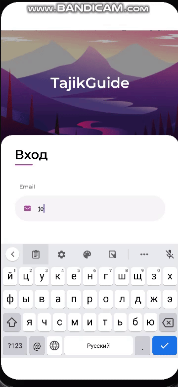
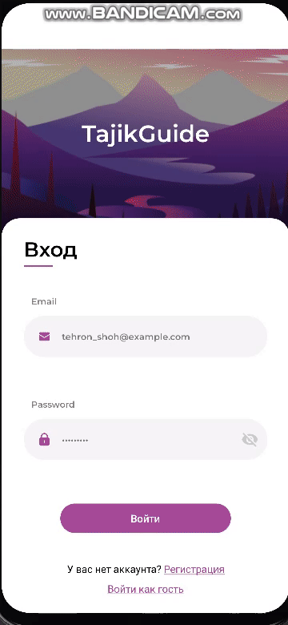

# Project Name

## Описание

1. TouristMap
<div style="display: flex; overflow-x: auto;">    </div>` 
## Цель

Цель проекта.

## Используемые технологии

- Android SDK
- Язык программирования (Java/Kotlin)
- Библиотеки и фреймворки

## Установка и запуск

1. Клонируйте репозиторий:
   ```sh
   git clone https://github.com/username/Pet-Android-Projects.git
   cd Pet-Android-Projects/ProjectName
